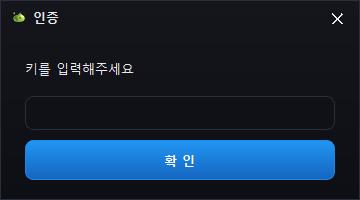
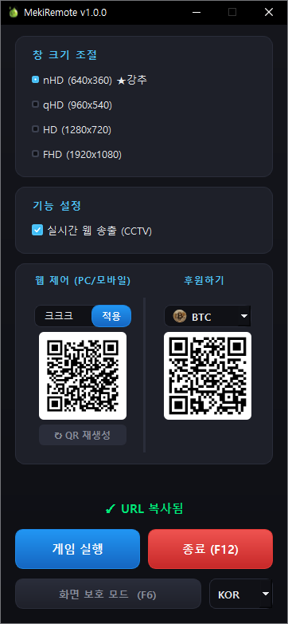
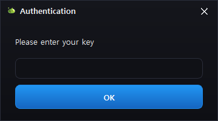
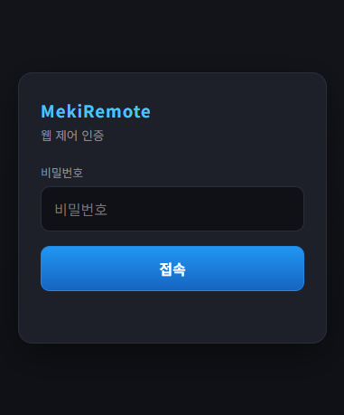
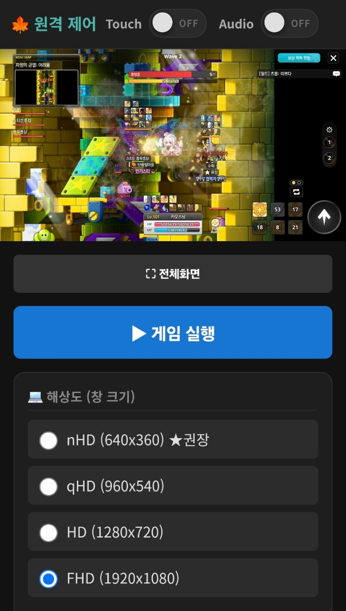
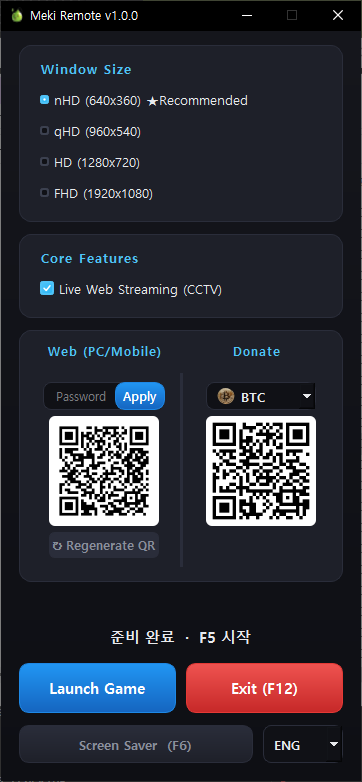
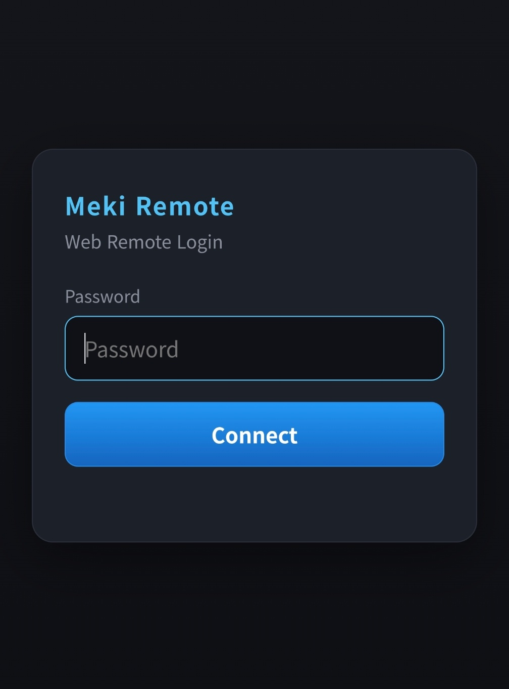
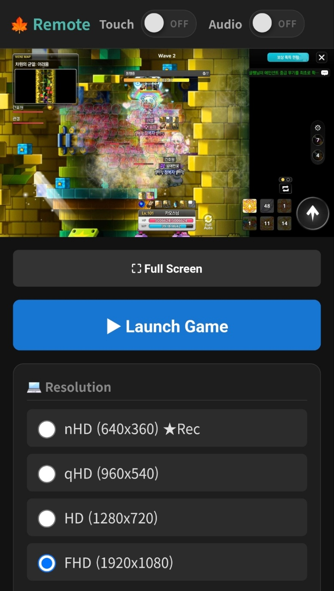

[English](#english) | [한국어](#korean)

---

# 🍁 Meki Remote (메키 리모트)
**가장 가볍고 안전한 메이플스토리 전용 원격 제어 솔루션**

Meki Remote는 게임 약관에 위배되는 자동사냥 '매크로' 프로그램이 아닙니다. 외부에서 내 PC에서 돌아가는 게임을 실시간으로 확인하고 제어할 수 있도록 돕는 **순수 원격 데스크탑(CCTV & Remote Control) 도구**입니다. 크롬 원격 데스크탑처럼 무겁지 않고, 오직 게임에만 집중하여 극한의 효율을 냅니다.

## ✨ 주요 기능 및 특징 (Key Features)

*   **⚡ 극한의 저사양 최적화 (Low-end PC Support)**
    무거운 화면 전송 기술 대신 최적화된 스트리밍 프로토콜을 사용했습니다. 사무용 구형 랩탑이나 엔트리급 그래픽 환경에서도 프레임 드랍이나 과도한 리소스 점유 없이 쾌적하게 24시간 백그라운드 구동이 가능합니다.
*   **🌐 언제 어디서나 외부 모니터링 (Anywhere, Anytime)**
    복잡한 공유기 설정이나 포트포워딩 지식이 없어도 괜찮습니다. 프로그램에서 제공하는 QR 코드만 스마트폰으로 스캔하면, 출퇴근길 지하철이든 회사든 어디서나 즉시 내 캐릭터의 상태를 모니터링하고 조작할 수 있습니다.
*   **🔒 금융권 수준의 1회용 세션 보안 (Bulletproof Security)**
    단순한 비밀번호 방식을 넘어, 클라이언트와 서버 간의 HMAC 챌린지-리스폰스 암호화 및 1회용 세션(One-time session) 토큰을 사용하여 해킹이나 외부 패킷 탈취로부터 완벽하게 안전합니다.
*   **🌍 다국어 완벽 지원 (Multi-language)**
    OS 환경에 맞춰 한국어(KOR)와 영어(ENG) UI가 자동으로 적용되어, 글로벌 유저들도 직관적으로 사용할 수 있습니다.

## 📸 스크린샷 (Screenshots)

### PC 클라이언트

### 웹 제어 화면 (모바일/PC)

## 💡 이런 분들께 강력 추천합니다!
*   크롬 원격 데스크탑을 켜두면 게임이 버벅거려서 스트레스받으셨던 분
*   회사 몰래 스마트폰으로 가끔씩 화면만 슥 확인하고 싶으신 분
*   배터리 걱정, 발열 걱정 없이 24시간 방치형 플레이를 유지하고 싶으신 분

## 🤝 광고 문의 및 후원 (Donate & Contact)
Meki Remote는 개인 개발자의 열정으로 만들어진 무료 소프트웨어입니다. 프로그램이 마음에 드셨다면 서버 유지보수와 지속적인 업데이트를 위해 따뜻한 후원 부탁드립니다! (프로그램 내 우측 하단 QR 코드를 통해서도 후원하실 수 있습니다.)

*   **BTC:** `bc1qcf9unc4v759cmt35fsg9xg8epjfsw3kvycr3lr`
*   **ETH:** `0x73639d754742a89bf9b2fd4ac0c9aa7661f3d42a`
*   **TRX:** `TVu5ev7NKrF6tdQonWreHBsYrT4YQKkw83`
*   **광고 및 비즈니스 제휴 문의:** *(여기에 이메일이나 연락처를 적어주세요)*

  

---

# 🍁 Meki Remote
**The Lightest & Most Secure Remote Control Solution for MapleStory**

Meki Remote is **NOT** an illegal auto-hunting macro violating game terms. It is a pure remote desktop (CCTV & Remote Control) tool designed to let you securely monitor and control your game running on your PC from anywhere. Unlike Chrome Remote Desktop, which can be heavy and resource-intensive, Meki Remote is highly optimized specifically for gaming to maximize efficiency.

## ✨ Key Features

*   **⚡ Extreme Optimization for Low-end PCs**
    Instead of heavy screen-casting technologies, we use an optimized streaming protocol. It runs smoothly 24/7 in the background without frame drops or high resource consumption, even on older office laptops or entry-level GPUs.
*   **🌐 Monitor Anywhere, Anytime**
    No complicated router settings or port-forwarding knowledge is required. Simply scan the provided QR code with your smartphone, and you can instantly monitor and control your character whether you're commuting or at work.
*   **🔒 Bank-Grade One-Time Session Security**
    Going beyond simple passwords, Meki Remote uses HMAC Challenge-Response encryption and One-time session tokens between the client and server. It is completely safe from hacking or external packet sniffing.
*   **🌍 Seamless Multi-language Support**
    The KOR/ENG UI is automatically applied based on your OS environment, offering an intuitive experience for global users.

## 📸 Screenshots

### PC Client

### Web Interface (Mobile/PC)

## 💡 Highly Recommended For:
*   Users who experienced lag or stuttering while using Chrome Remote Desktop.
*   Users who want to take a quick peek at their game on their smartphone during work hours.
*   Users who want to run the game 24/7 without worrying about their phone's battery drain or overheating.

## 🤝 Donate & Contact
Meki Remote is a free software created out of a solo developer's passion. If you find this tool helpful, please consider donating to support server maintenance and continuous updates! (You can also donate via the QR code in the bottom right corner of the app).

*   **BTC:** `bc1qcf9unc4v759cmt35fsg9xg8epjfsw3kvycr3lr`
*   **ETH:** `0x73639d754742a89bf9b2fd4ac0c9aa7661f3d42a`
*   **TRX:** `TVu5ev7NKrF6tdQonWreHBsYrT4YQKkw83`
*   **Business / Ads Inquiry:** *(Insert your email or contact info here)*